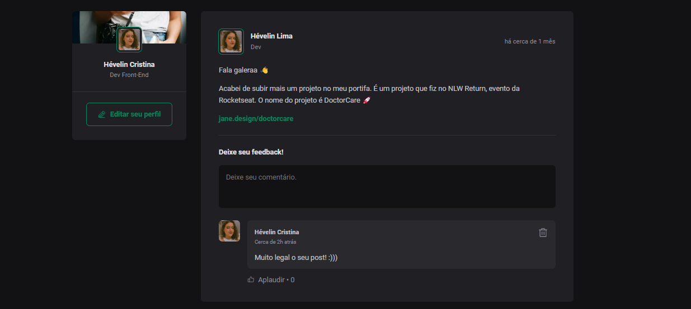

<h1 align="center"> Feed app </h1>

 

  

 

## 💻 Projeto

O Feed é um app semelhante a uma rede social, e permite:

- Adicionar um novo post
- Deixar comentários no post
- Curtir os comentários
- Deletar os comentários

Para o desenvolvimento dessas funcionalidades, foram utilizados conceitos como:

- Estados
- Imutabilidade do estado
- Listas e chaves no ReactJS
- Propriedades
- Componentização

## 🚀 Tecnologias

Esse projeto foi desenvolvido com as seguintes tecnologias:

- HTML
- CSS
- TypeScript
- React
- Git e Github
- Vite
- Figma
