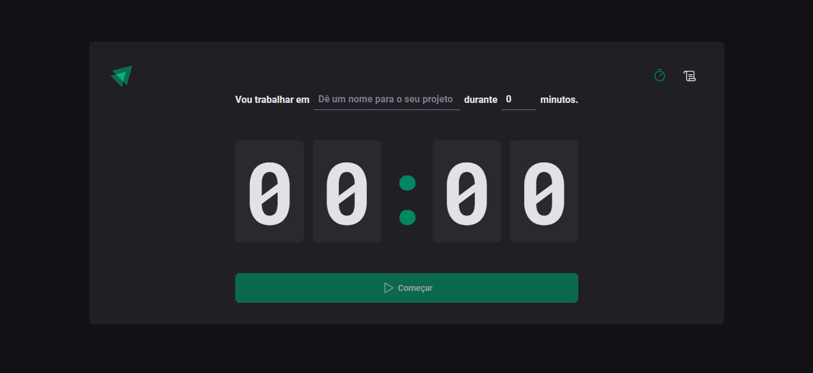
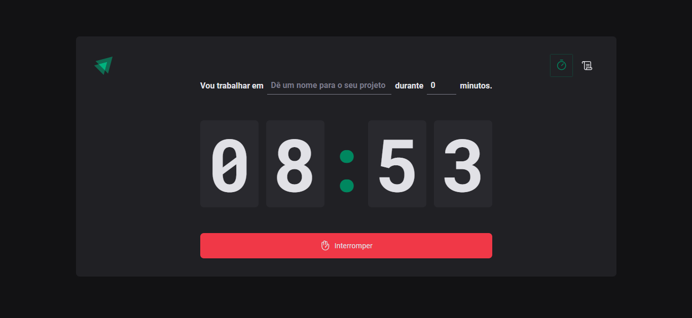
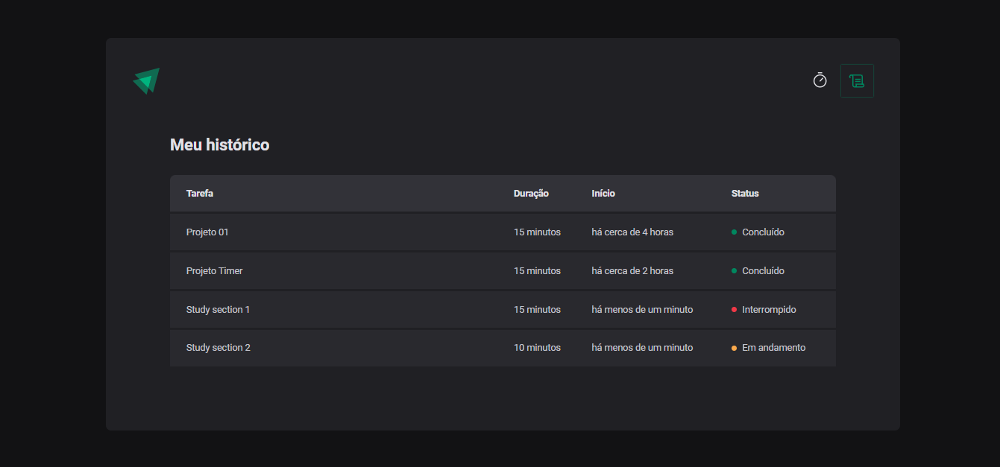

<h1 align="center"> Timer </h1>

 

  
  
  

 

## 💻 Projeto

O Timer é um app de gerenciamento de tempo inspirado no método Pomodoro, e permite:

- Adicionar um novo ciclo (ciclos podem ter entre 5 e 60 minutos)
- Interrupção do ciclo a qualquer momento
- Mostrar o histórico de ciclos criados
- Visualizar o status dos ciclos

Para o desenvolvimento dessas funcionalidades, foram utilizados conceitos como:

- Estados, Propriedades e Componentização
- Imutabilidade do estado
- Estilização com styled-components
- ContextAPI e useEffect
- localStorage

## 🚀 Tecnologias

Esse projeto foi desenvolvido com as seguintes tecnologias:

- HTML e CSS
- TypeScript
- React
- Git e Github
- Vite
- Figma
