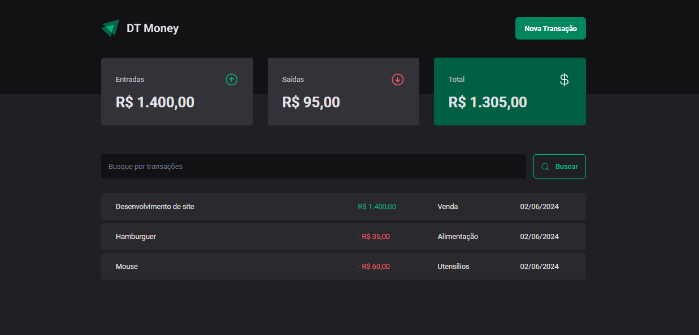

<h1 align="center"> DT Money </h1>

 

  

 

## 💻 Projeto

O DT Money é um app de organização financeira, e permite:

- Adicionar uma nova transação realizada
- Calcular os valores de entrada, saída e o total
- Realizar busca por transações

Para o desenvolvimento dessas funcionalidades, foram utilizados conceitos como:

- Estados
- Propriedades e Componentização
- Fetch / Axios
- Roteamento e React Router DOM
- Formulários

## 🚀 Tecnologias

Esse projeto foi desenvolvido com as seguintes tecnologias:

- HTML + CSS
- TypeScript
- React
- Json-server
- Git e Github
- Vite
- Figma

---

Feito com ♥ by hevelinlima

