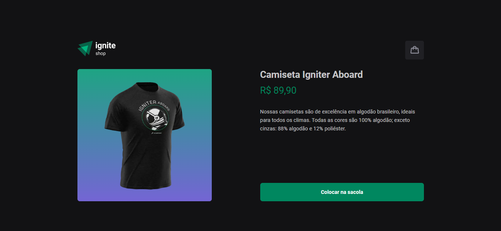
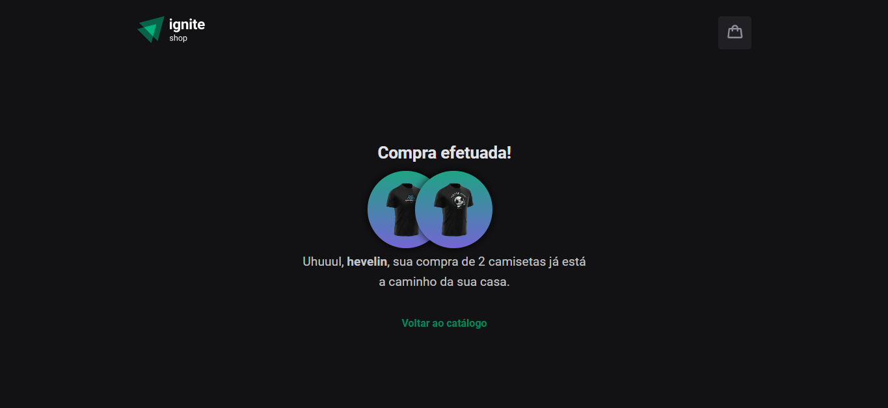

<h1 align="center"> DT Money </h1>

 

  
  
  

 

## 💻 Projeto

O Ignite Shop é um app de compras que contém um carrinho que utiliza os dados da API do Stripe para buscar os itens existentes, e controla, através da sua aplicação, o número de itens que o usuário deseja comprar, e permite também:

- Adicionar/remover itens ao carrinho
- Realizar o "pagamento" do valor total dos itens do carrinho
- Redirecionamento à uma página de sucesso após o pagamento

Para o desenvolvimento dessas funcionalidades, foram utilizados conceitos como:

- Estados
- Propriedades e Componentização
- GetStaticProps

## 🚀 Tecnologias

Esse projeto foi desenvolvido com as seguintes tecnologias:

- HTML + CSS
- TypeScript
- NextJs
- Stripe
- Git e Github
- Figma

---

Feito com ♥ by hevelinlima
