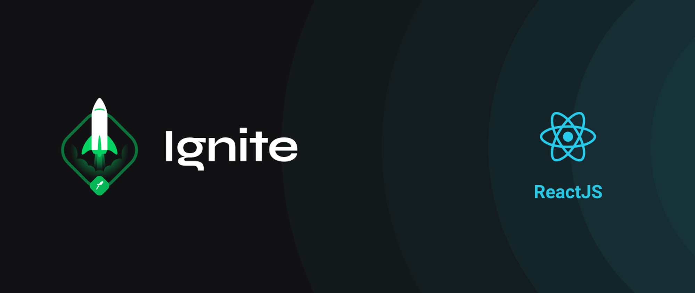

  

# 🔍 Sobre

O Ignite é um projeto da Rocketseat focado em várias tecnologias. Este repositório apresenta os códigos desenvolvidos dentro da jornada de ReactJS.

# 📖 Conteúdo
## Módulo #1: Fundamentos do ReactJS
💻 App - [Feed](https://github.com/hevelinlima/ignite-react/tree/main/01-feed)

Foram abordados temas como estados, componentização, propriedades, imutabilidade dos estados e também foram apresentados os métodos map, filter e reduce.

## Módulo #2: Criando Single Page Applications com ReactJS
💻 App - [Timer](https://github.com/hevelinlima/ignite-react/tree/main/02-timer)

Além de revisitar os conceitos do módulo anterior, este módulo aborda assuntos como contextAPI, useEffect e localStorage.

--- 
